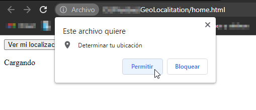
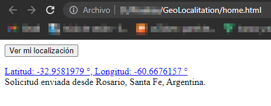

# Geolocalización - Geolocalitation 📌

Aplicación simple en HTML y JS para obtener la localización del usuario.  
Simple application in HTML and JS to obtain the location of the user. 

Al iniciar el usuario autoriza que la aplicación pueda obtener la localización. - 
When starting, the user authorizes the application to obtain the location.

La aplicación muestra latitud, longitud e información de la ubicación del usuario, dependiendo que se quiera mostrar. - 
The app displays latitude, longitude, and user location information, depending on what you want to display.

El JSON que formamos con la respuesta es el que luego utilizamos para mostrar, este puede variar según la consulta. - JSON that we form with the response is the one that we then use to display, this may vary depending on the query.

